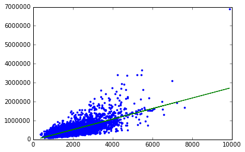

```python
import graphlab
```

# Load house data


```python
sales=graphlab.SFrame('home_data.gl/')
```

    /opt/conda/lib/python2.7/site-packages/requests/packages/urllib3/connection.py:266: SubjectAltNameWarning: Certificate for beta.graphlab.com has no `subjectAltName`, falling back to check for a `commonName` for now. This feature is being removed by major browsers and deprecated by RFC 2818. (See https://github.com/shazow/urllib3/issues/497 for details.)
      SubjectAltNameWarning
    [INFO] graphlab.cython.cy_server: GraphLab Create v2.0.1 started. Logging: /tmp/graphlab_server_1471890497.log


    This non-commercial license of GraphLab Create for academic use is assigned to dharun199531@gmail.com and will expire on August 17, 2017.


```python
sales

```


<div style="max-height:1000px;max-width:1500px;overflow:auto;"><table frame="box" rules="cols">
    <tr>
        <th style="padding-left: 1em; padding-right: 1em; text-align: center">id</th>
        <th style="padding-left: 1em; padding-right: 1em; text-align: center">date</th>
        <th style="padding-left: 1em; padding-right: 1em; text-align: center">price</th>
        <th style="padding-left: 1em; padding-right: 1em; text-align: center">bedrooms</th>
        <th style="padding-left: 1em; padding-right: 1em; text-align: center">bathrooms</th>
        <th style="padding-left: 1em; padding-right: 1em; text-align: center">sqft_living</th>
        <th style="padding-left: 1em; padding-right: 1em; text-align: center">sqft_lot</th>
        <th style="padding-left: 1em; padding-right: 1em; text-align: center">floors</th>
        <th style="padding-left: 1em; padding-right: 1em; text-align: center">waterfront</th>
    </tr>
    <tr>
        <td style="padding-left: 1em; padding-right: 1em; text-align: center; vertical-align: top">7129300520</td>
        <td style="padding-left: 1em; padding-right: 1em; text-align: center; vertical-align: top">2014-10-13 00:00:00+00:00</td>
        <td style="padding-left: 1em; padding-right: 1em; text-align: center; vertical-align: top">221900</td>
        <td style="padding-left: 1em; padding-right: 1em; text-align: center; vertical-align: top">3</td>
        <td style="padding-left: 1em; padding-right: 1em; text-align: center; vertical-align: top">1</td>
        <td style="padding-left: 1em; padding-right: 1em; text-align: center; vertical-align: top">1180</td>
        <td style="padding-left: 1em; padding-right: 1em; text-align: center; vertical-align: top">5650</td>
        <td style="padding-left: 1em; padding-right: 1em; text-align: center; vertical-align: top">1</td>
        <td style="padding-left: 1em; padding-right: 1em; text-align: center; vertical-align: top">0</td>
    </tr>
    <tr>
        <td style="padding-left: 1em; padding-right: 1em; text-align: center; vertical-align: top">6414100192</td>
        <td style="padding-left: 1em; padding-right: 1em; text-align: center; vertical-align: top">2014-12-09 00:00:00+00:00</td>
        <td style="padding-left: 1em; padding-right: 1em; text-align: center; vertical-align: top">538000</td>
        <td style="padding-left: 1em; padding-right: 1em; text-align: center; vertical-align: top">3</td>
        <td style="padding-left: 1em; padding-right: 1em; text-align: center; vertical-align: top">2.25</td>
        <td style="padding-left: 1em; padding-right: 1em; text-align: center; vertical-align: top">2570</td>
        <td style="padding-left: 1em; padding-right: 1em; text-align: center; vertical-align: top">7242</td>
        <td style="padding-left: 1em; padding-right: 1em; text-align: center; vertical-align: top">2</td>
        <td style="padding-left: 1em; padding-right: 1em; text-align: center; vertical-align: top">0</td>
    </tr>
    <tr>
        <td style="padding-left: 1em; padding-right: 1em; text-align: center; vertical-align: top">5631500400</td>
        <td style="padding-left: 1em; padding-right: 1em; text-align: center; vertical-align: top">2015-02-25 00:00:00+00:00</td>
        <td style="padding-left: 1em; padding-right: 1em; text-align: center; vertical-align: top">180000</td>
        <td style="padding-left: 1em; padding-right: 1em; text-align: center; vertical-align: top">2</td>
        <td style="padding-left: 1em; padding-right: 1em; text-align: center; vertical-align: top">1</td>
        <td style="padding-left: 1em; padding-right: 1em; text-align: center; vertical-align: top">770</td>
        <td style="padding-left: 1em; padding-right: 1em; text-align: center; vertical-align: top">10000</td>
        <td style="padding-left: 1em; padding-right: 1em; text-align: center; vertical-align: top">1</td>
        <td style="padding-left: 1em; padding-right: 1em; text-align: center; vertical-align: top">0</td>
    </tr>
    <tr>
        <td style="padding-left: 1em; padding-right: 1em; text-align: center; vertical-align: top">2487200875</td>
        <td style="padding-left: 1em; padding-right: 1em; text-align: center; vertical-align: top">2014-12-09 00:00:00+00:00</td>
        <td style="padding-left: 1em; padding-right: 1em; text-align: center; vertical-align: top">604000</td>
        <td style="padding-left: 1em; padding-right: 1em; text-align: center; vertical-align: top">4</td>
        <td style="padding-left: 1em; padding-right: 1em; text-align: center; vertical-align: top">3</td>
        <td style="padding-left: 1em; padding-right: 1em; text-align: center; vertical-align: top">1960</td>
        <td style="padding-left: 1em; padding-right: 1em; text-align: center; vertical-align: top">5000</td>
        <td style="padding-left: 1em; padding-right: 1em; text-align: center; vertical-align: top">1</td>
        <td style="padding-left: 1em; padding-right: 1em; text-align: center; vertical-align: top">0</td>
    </tr>
    <tr>
        <td style="padding-left: 1em; padding-right: 1em; text-align: center; vertical-align: top">1954400510</td>
        <td style="padding-left: 1em; padding-right: 1em; text-align: center; vertical-align: top">2015-02-18 00:00:00+00:00</td>
        <td style="padding-left: 1em; padding-right: 1em; text-align: center; vertical-align: top">510000</td>
        <td style="padding-left: 1em; padding-right: 1em; text-align: center; vertical-align: top">3</td>
        <td style="padding-left: 1em; padding-right: 1em; text-align: center; vertical-align: top">2</td>
        <td style="padding-left: 1em; padding-right: 1em; text-align: center; vertical-align: top">1680</td>
        <td style="padding-left: 1em; padding-right: 1em; text-align: center; vertical-align: top">8080</td>
        <td style="padding-left: 1em; padding-right: 1em; text-align: center; vertical-align: top">1</td>
        <td style="padding-left: 1em; padding-right: 1em; text-align: center; vertical-align: top">0</td>
    </tr>
    <tr>
        <td style="padding-left: 1em; padding-right: 1em; text-align: center; vertical-align: top">7237550310</td>
        <td style="padding-left: 1em; padding-right: 1em; text-align: center; vertical-align: top">2014-05-12 00:00:00+00:00</td>
        <td style="padding-left: 1em; padding-right: 1em; text-align: center; vertical-align: top">1225000</td>
        <td style="padding-left: 1em; padding-right: 1em; text-align: center; vertical-align: top">4</td>
        <td style="padding-left: 1em; padding-right: 1em; text-align: center; vertical-align: top">4.5</td>
        <td style="padding-left: 1em; padding-right: 1em; text-align: center; vertical-align: top">5420</td>
        <td style="padding-left: 1em; padding-right: 1em; text-align: center; vertical-align: top">101930</td>
        <td style="padding-left: 1em; padding-right: 1em; text-align: center; vertical-align: top">1</td>
        <td style="padding-left: 1em; padding-right: 1em; text-align: center; vertical-align: top">0</td>
    </tr>
    <tr>
        <td style="padding-left: 1em; padding-right: 1em; text-align: center; vertical-align: top">1321400060</td>
        <td style="padding-left: 1em; padding-right: 1em; text-align: center; vertical-align: top">2014-06-27 00:00:00+00:00</td>
        <td style="padding-left: 1em; padding-right: 1em; text-align: center; vertical-align: top">257500</td>
        <td style="padding-left: 1em; padding-right: 1em; text-align: center; vertical-align: top">3</td>
        <td style="padding-left: 1em; padding-right: 1em; text-align: center; vertical-align: top">2.25</td>
        <td style="padding-left: 1em; padding-right: 1em; text-align: center; vertical-align: top">1715</td>
        <td style="padding-left: 1em; padding-right: 1em; text-align: center; vertical-align: top">6819</td>
        <td style="padding-left: 1em; padding-right: 1em; text-align: center; vertical-align: top">2</td>
        <td style="padding-left: 1em; padding-right: 1em; text-align: center; vertical-align: top">0</td>
    </tr>
    <tr>
        <td style="padding-left: 1em; padding-right: 1em; text-align: center; vertical-align: top">2008000270</td>
        <td style="padding-left: 1em; padding-right: 1em; text-align: center; vertical-align: top">2015-01-15 00:00:00+00:00</td>
        <td style="padding-left: 1em; padding-right: 1em; text-align: center; vertical-align: top">291850</td>
        <td style="padding-left: 1em; padding-right: 1em; text-align: center; vertical-align: top">3</td>
        <td style="padding-left: 1em; padding-right: 1em; text-align: center; vertical-align: top">1.5</td>
        <td style="padding-left: 1em; padding-right: 1em; text-align: center; vertical-align: top">1060</td>
        <td style="padding-left: 1em; padding-right: 1em; text-align: center; vertical-align: top">9711</td>
        <td style="padding-left: 1em; padding-right: 1em; text-align: center; vertical-align: top">1</td>
        <td style="padding-left: 1em; padding-right: 1em; text-align: center; vertical-align: top">0</td>
    </tr>
    <tr>
        <td style="padding-left: 1em; padding-right: 1em; text-align: center; vertical-align: top">2414600126</td>
        <td style="padding-left: 1em; padding-right: 1em; text-align: center; vertical-align: top">2015-04-15 00:00:00+00:00</td>
        <td style="padding-left: 1em; padding-right: 1em; text-align: center; vertical-align: top">229500</td>
        <td style="padding-left: 1em; padding-right: 1em; text-align: center; vertical-align: top">3</td>
        <td style="padding-left: 1em; padding-right: 1em; text-align: center; vertical-align: top">1</td>
        <td style="padding-left: 1em; padding-right: 1em; text-align: center; vertical-align: top">1780</td>
        <td style="padding-left: 1em; padding-right: 1em; text-align: center; vertical-align: top">7470</td>
        <td style="padding-left: 1em; padding-right: 1em; text-align: center; vertical-align: top">1</td>
        <td style="padding-left: 1em; padding-right: 1em; text-align: center; vertical-align: top">0</td>
    </tr>
    <tr>
        <td style="padding-left: 1em; padding-right: 1em; text-align: center; vertical-align: top">3793500160</td>
        <td style="padding-left: 1em; padding-right: 1em; text-align: center; vertical-align: top">2015-03-12 00:00:00+00:00</td>
        <td style="padding-left: 1em; padding-right: 1em; text-align: center; vertical-align: top">323000</td>
        <td style="padding-left: 1em; padding-right: 1em; text-align: center; vertical-align: top">3</td>
        <td style="padding-left: 1em; padding-right: 1em; text-align: center; vertical-align: top">2.5</td>
        <td style="padding-left: 1em; padding-right: 1em; text-align: center; vertical-align: top">1890</td>
        <td style="padding-left: 1em; padding-right: 1em; text-align: center; vertical-align: top">6560</td>
        <td style="padding-left: 1em; padding-right: 1em; text-align: center; vertical-align: top">2</td>
        <td style="padding-left: 1em; padding-right: 1em; text-align: center; vertical-align: top">0</td>
    </tr>
</table>
<table frame="box" rules="cols">
    <tr>
        <th style="padding-left: 1em; padding-right: 1em; text-align: center">view</th>
        <th style="padding-left: 1em; padding-right: 1em; text-align: center">condition</th>
        <th style="padding-left: 1em; padding-right: 1em; text-align: center">grade</th>
        <th style="padding-left: 1em; padding-right: 1em; text-align: center">sqft_above</th>
        <th style="padding-left: 1em; padding-right: 1em; text-align: center">sqft_basement</th>
        <th style="padding-left: 1em; padding-right: 1em; text-align: center">yr_built</th>
        <th style="padding-left: 1em; padding-right: 1em; text-align: center">yr_renovated</th>
        <th style="padding-left: 1em; padding-right: 1em; text-align: center">zipcode</th>
        <th style="padding-left: 1em; padding-right: 1em; text-align: center">lat</th>
    </tr>
    <tr>
        <td style="padding-left: 1em; padding-right: 1em; text-align: center; vertical-align: top">0</td>
        <td style="padding-left: 1em; padding-right: 1em; text-align: center; vertical-align: top">3</td>
        <td style="padding-left: 1em; padding-right: 1em; text-align: center; vertical-align: top">7</td>
        <td style="padding-left: 1em; padding-right: 1em; text-align: center; vertical-align: top">1180</td>
        <td style="padding-left: 1em; padding-right: 1em; text-align: center; vertical-align: top">0</td>
        <td style="padding-left: 1em; padding-right: 1em; text-align: center; vertical-align: top">1955</td>
        <td style="padding-left: 1em; padding-right: 1em; text-align: center; vertical-align: top">0</td>
        <td style="padding-left: 1em; padding-right: 1em; text-align: center; vertical-align: top">98178</td>
        <td style="padding-left: 1em; padding-right: 1em; text-align: center; vertical-align: top">47.51123398</td>
    </tr>
    <tr>
        <td style="padding-left: 1em; padding-right: 1em; text-align: center; vertical-align: top">0</td>
        <td style="padding-left: 1em; padding-right: 1em; text-align: center; vertical-align: top">3</td>
        <td style="padding-left: 1em; padding-right: 1em; text-align: center; vertical-align: top">7</td>
        <td style="padding-left: 1em; padding-right: 1em; text-align: center; vertical-align: top">2170</td>
        <td style="padding-left: 1em; padding-right: 1em; text-align: center; vertical-align: top">400</td>
        <td style="padding-left: 1em; padding-right: 1em; text-align: center; vertical-align: top">1951</td>
        <td style="padding-left: 1em; padding-right: 1em; text-align: center; vertical-align: top">1991</td>
        <td style="padding-left: 1em; padding-right: 1em; text-align: center; vertical-align: top">98125</td>
        <td style="padding-left: 1em; padding-right: 1em; text-align: center; vertical-align: top">47.72102274</td>
    </tr>
    <tr>
        <td style="padding-left: 1em; padding-right: 1em; text-align: center; vertical-align: top">0</td>
        <td style="padding-left: 1em; padding-right: 1em; text-align: center; vertical-align: top">3</td>
        <td style="padding-left: 1em; padding-right: 1em; text-align: center; vertical-align: top">6</td>
        <td style="padding-left: 1em; padding-right: 1em; text-align: center; vertical-align: top">770</td>
        <td style="padding-left: 1em; padding-right: 1em; text-align: center; vertical-align: top">0</td>
        <td style="padding-left: 1em; padding-right: 1em; text-align: center; vertical-align: top">1933</td>
        <td style="padding-left: 1em; padding-right: 1em; text-align: center; vertical-align: top">0</td>
        <td style="padding-left: 1em; padding-right: 1em; text-align: center; vertical-align: top">98028</td>
        <td style="padding-left: 1em; padding-right: 1em; text-align: center; vertical-align: top">47.73792661</td>
    </tr>
    <tr>
        <td style="padding-left: 1em; padding-right: 1em; text-align: center; vertical-align: top">0</td>
        <td style="padding-left: 1em; padding-right: 1em; text-align: center; vertical-align: top">5</td>
        <td style="padding-left: 1em; padding-right: 1em; text-align: center; vertical-align: top">7</td>
        <td style="padding-left: 1em; padding-right: 1em; text-align: center; vertical-align: top">1050</td>
        <td style="padding-left: 1em; padding-right: 1em; text-align: center; vertical-align: top">910</td>
        <td style="padding-left: 1em; padding-right: 1em; text-align: center; vertical-align: top">1965</td>
        <td style="padding-left: 1em; padding-right: 1em; text-align: center; vertical-align: top">0</td>
        <td style="padding-left: 1em; padding-right: 1em; text-align: center; vertical-align: top">98136</td>
        <td style="padding-left: 1em; padding-right: 1em; text-align: center; vertical-align: top">47.52082</td>
    </tr>
    <tr>
        <td style="padding-left: 1em; padding-right: 1em; text-align: center; vertical-align: top">0</td>
        <td style="padding-left: 1em; padding-right: 1em; text-align: center; vertical-align: top">3</td>
        <td style="padding-left: 1em; padding-right: 1em; text-align: center; vertical-align: top">8</td>
        <td style="padding-left: 1em; padding-right: 1em; text-align: center; vertical-align: top">1680</td>
        <td style="padding-left: 1em; padding-right: 1em; text-align: center; vertical-align: top">0</td>
        <td style="padding-left: 1em; padding-right: 1em; text-align: center; vertical-align: top">1987</td>
        <td style="padding-left: 1em; padding-right: 1em; text-align: center; vertical-align: top">0</td>
        <td style="padding-left: 1em; padding-right: 1em; text-align: center; vertical-align: top">98074</td>
        <td style="padding-left: 1em; padding-right: 1em; text-align: center; vertical-align: top">47.61681228</td>
    </tr>
    <tr>
        <td style="padding-left: 1em; padding-right: 1em; text-align: center; vertical-align: top">0</td>
        <td style="padding-left: 1em; padding-right: 1em; text-align: center; vertical-align: top">3</td>
        <td style="padding-left: 1em; padding-right: 1em; text-align: center; vertical-align: top">11</td>
        <td style="padding-left: 1em; padding-right: 1em; text-align: center; vertical-align: top">3890</td>
        <td style="padding-left: 1em; padding-right: 1em; text-align: center; vertical-align: top">1530</td>
        <td style="padding-left: 1em; padding-right: 1em; text-align: center; vertical-align: top">2001</td>
        <td style="padding-left: 1em; padding-right: 1em; text-align: center; vertical-align: top">0</td>
        <td style="padding-left: 1em; padding-right: 1em; text-align: center; vertical-align: top">98053</td>
        <td style="padding-left: 1em; padding-right: 1em; text-align: center; vertical-align: top">47.65611835</td>
    </tr>
    <tr>
        <td style="padding-left: 1em; padding-right: 1em; text-align: center; vertical-align: top">0</td>
        <td style="padding-left: 1em; padding-right: 1em; text-align: center; vertical-align: top">3</td>
        <td style="padding-left: 1em; padding-right: 1em; text-align: center; vertical-align: top">7</td>
        <td style="padding-left: 1em; padding-right: 1em; text-align: center; vertical-align: top">1715</td>
        <td style="padding-left: 1em; padding-right: 1em; text-align: center; vertical-align: top">0</td>
        <td style="padding-left: 1em; padding-right: 1em; text-align: center; vertical-align: top">1995</td>
        <td style="padding-left: 1em; padding-right: 1em; text-align: center; vertical-align: top">0</td>
        <td style="padding-left: 1em; padding-right: 1em; text-align: center; vertical-align: top">98003</td>
        <td style="padding-left: 1em; padding-right: 1em; text-align: center; vertical-align: top">47.30972002</td>
    </tr>
    <tr>
        <td style="padding-left: 1em; padding-right: 1em; text-align: center; vertical-align: top">0</td>
        <td style="padding-left: 1em; padding-right: 1em; text-align: center; vertical-align: top">3</td>
        <td style="padding-left: 1em; padding-right: 1em; text-align: center; vertical-align: top">7</td>
        <td style="padding-left: 1em; padding-right: 1em; text-align: center; vertical-align: top">1060</td>
        <td style="padding-left: 1em; padding-right: 1em; text-align: center; vertical-align: top">0</td>
        <td style="padding-left: 1em; padding-right: 1em; text-align: center; vertical-align: top">1963</td>
        <td style="padding-left: 1em; padding-right: 1em; text-align: center; vertical-align: top">0</td>
        <td style="padding-left: 1em; padding-right: 1em; text-align: center; vertical-align: top">98198</td>
        <td style="padding-left: 1em; padding-right: 1em; text-align: center; vertical-align: top">47.40949984</td>
    </tr>
    <tr>
        <td style="padding-left: 1em; padding-right: 1em; text-align: center; vertical-align: top">0</td>
        <td style="padding-left: 1em; padding-right: 1em; text-align: center; vertical-align: top">3</td>
        <td style="padding-left: 1em; padding-right: 1em; text-align: center; vertical-align: top">7</td>
        <td style="padding-left: 1em; padding-right: 1em; text-align: center; vertical-align: top">1050</td>
        <td style="padding-left: 1em; padding-right: 1em; text-align: center; vertical-align: top">730</td>
        <td style="padding-left: 1em; padding-right: 1em; text-align: center; vertical-align: top">1960</td>
        <td style="padding-left: 1em; padding-right: 1em; text-align: center; vertical-align: top">0</td>
        <td style="padding-left: 1em; padding-right: 1em; text-align: center; vertical-align: top">98146</td>
        <td style="padding-left: 1em; padding-right: 1em; text-align: center; vertical-align: top">47.51229381</td>
    </tr>
    <tr>
        <td style="padding-left: 1em; padding-right: 1em; text-align: center; vertical-align: top">0</td>
        <td style="padding-left: 1em; padding-right: 1em; text-align: center; vertical-align: top">3</td>
        <td style="padding-left: 1em; padding-right: 1em; text-align: center; vertical-align: top">7</td>
        <td style="padding-left: 1em; padding-right: 1em; text-align: center; vertical-align: top">1890</td>
        <td style="padding-left: 1em; padding-right: 1em; text-align: center; vertical-align: top">0</td>
        <td style="padding-left: 1em; padding-right: 1em; text-align: center; vertical-align: top">2003</td>
        <td style="padding-left: 1em; padding-right: 1em; text-align: center; vertical-align: top">0</td>
        <td style="padding-left: 1em; padding-right: 1em; text-align: center; vertical-align: top">98038</td>
        <td style="padding-left: 1em; padding-right: 1em; text-align: center; vertical-align: top">47.36840673</td>
    </tr>
</table>
<table frame="box" rules="cols">
    <tr>
        <th style="padding-left: 1em; padding-right: 1em; text-align: center">long</th>
        <th style="padding-left: 1em; padding-right: 1em; text-align: center">sqft_living15</th>
        <th style="padding-left: 1em; padding-right: 1em; text-align: center">sqft_lot15</th>
    </tr>
    <tr>
        <td style="padding-left: 1em; padding-right: 1em; text-align: center; vertical-align: top">-122.25677536</td>
        <td style="padding-left: 1em; padding-right: 1em; text-align: center; vertical-align: top">1340.0</td>
        <td style="padding-left: 1em; padding-right: 1em; text-align: center; vertical-align: top">5650.0</td>
    </tr>
    <tr>
        <td style="padding-left: 1em; padding-right: 1em; text-align: center; vertical-align: top">-122.3188624</td>
        <td style="padding-left: 1em; padding-right: 1em; text-align: center; vertical-align: top">1690.0</td>
        <td style="padding-left: 1em; padding-right: 1em; text-align: center; vertical-align: top">7639.0</td>
    </tr>
    <tr>
        <td style="padding-left: 1em; padding-right: 1em; text-align: center; vertical-align: top">-122.23319601</td>
        <td style="padding-left: 1em; padding-right: 1em; text-align: center; vertical-align: top">2720.0</td>
        <td style="padding-left: 1em; padding-right: 1em; text-align: center; vertical-align: top">8062.0</td>
    </tr>
    <tr>
        <td style="padding-left: 1em; padding-right: 1em; text-align: center; vertical-align: top">-122.39318505</td>
        <td style="padding-left: 1em; padding-right: 1em; text-align: center; vertical-align: top">1360.0</td>
        <td style="padding-left: 1em; padding-right: 1em; text-align: center; vertical-align: top">5000.0</td>
    </tr>
    <tr>
        <td style="padding-left: 1em; padding-right: 1em; text-align: center; vertical-align: top">-122.04490059</td>
        <td style="padding-left: 1em; padding-right: 1em; text-align: center; vertical-align: top">1800.0</td>
        <td style="padding-left: 1em; padding-right: 1em; text-align: center; vertical-align: top">7503.0</td>
    </tr>
    <tr>
        <td style="padding-left: 1em; padding-right: 1em; text-align: center; vertical-align: top">-122.00528655</td>
        <td style="padding-left: 1em; padding-right: 1em; text-align: center; vertical-align: top">4760.0</td>
        <td style="padding-left: 1em; padding-right: 1em; text-align: center; vertical-align: top">101930.0</td>
    </tr>
    <tr>
        <td style="padding-left: 1em; padding-right: 1em; text-align: center; vertical-align: top">-122.32704857</td>
        <td style="padding-left: 1em; padding-right: 1em; text-align: center; vertical-align: top">2238.0</td>
        <td style="padding-left: 1em; padding-right: 1em; text-align: center; vertical-align: top">6819.0</td>
    </tr>
    <tr>
        <td style="padding-left: 1em; padding-right: 1em; text-align: center; vertical-align: top">-122.31457273</td>
        <td style="padding-left: 1em; padding-right: 1em; text-align: center; vertical-align: top">1650.0</td>
        <td style="padding-left: 1em; padding-right: 1em; text-align: center; vertical-align: top">9711.0</td>
    </tr>
    <tr>
        <td style="padding-left: 1em; padding-right: 1em; text-align: center; vertical-align: top">-122.33659507</td>
        <td style="padding-left: 1em; padding-right: 1em; text-align: center; vertical-align: top">1780.0</td>
        <td style="padding-left: 1em; padding-right: 1em; text-align: center; vertical-align: top">8113.0</td>
    </tr>
    <tr>
        <td style="padding-left: 1em; padding-right: 1em; text-align: center; vertical-align: top">-122.0308176</td>
        <td style="padding-left: 1em; padding-right: 1em; text-align: center; vertical-align: top">2390.0</td>
        <td style="padding-left: 1em; padding-right: 1em; text-align: center; vertical-align: top">7570.0</td>
    </tr>
</table>
[21613 rows x 21 columns]<br/>Note: Only the head of the SFrame is printed.<br/>You can use print_rows(num_rows=m, num_columns=n) to print more rows and columns.
</div>


# Exploring data


```python
graphlab.canvas.set_target('ipynb')
sales.show(view="Scatter Plot",x="Sq_ft",y="price")
```


```python
graphlab.canvas.set_target('ipynb')
sales.show(view="Scatter Plot",x="Sqft_living",y="price")
```


```python
graphlab.canvas.set_target('ipynb')
sales.show(view="Scatter Plot",x="sqft_living",y="price")
```


# create a simple regression model for sqft to price


```python
train_data,test_data = sales.random_split(.8,seed=0)
```

sqft_model=graphlab.linear_regression.create(train_data, target='price',features=['sqft_living'])


```python
# evaluate model
```


```python
print test_data['price'].mean()
```

    543054.042563


```python
print sqft_model.evaluate(test_data)
```

    {'max_error': 4176275.8423837754, 'rmse': 255137.5216304084}


# lets show our predictions


```python
import matplotlib.pyplot as plt
```

    /opt/conda/lib/python2.7/site-packages/matplotlib/font_manager.py:273: UserWarning: Matplotlib is building the font cache using fc-list. This may take a moment.
      warnings.warn('Matplotlib is building the font cache using fc-list. This may take a moment.')


```python
%matplotlib inline
```


```python
plt.plot(test_data['sqft_living'],test_data['price'],'.',test_data['sqft_living'],sqft_model.predict(test_data),'-')
```


    [<matplotlib.lines.Line2D at 0x7f8931cb9290>,
     <matplotlib.lines.Line2D at 0x7f8931cb9350>]





```python
sqft_model.get('coefiecients')
```

    [ERROR] graphlab.toolkits._main: Toolkit error: Field 'coefiecients' does not exist. Use list_fields() for a list of fields that can be queried.
    


    ---------------------------------------------------------------------------

    ToolkitError                              Traceback (most recent call last)

    <ipython-input-15-a88474f12a5c> in <module>()
    ----> 1 sqft_model.get('coefiecients')
    

    /opt/conda/lib/python2.7/site-packages/graphlab/toolkits/regression/linear_regression.pyc in get(self, field)
        514 
        515         _mt._get_metric_tracker().track('toolkit.regression.linear_regression.get')
    --> 516         return super(LinearRegression, self).get(field)
        517 
        518 


    /opt/conda/lib/python2.7/site-packages/graphlab/toolkits/_supervised_learning.pyc in get(self, field)
        224                 'model_name': self.__name__,
        225                 'field': field}
    --> 226         response = _graphlab.toolkits._main.run('supervised_learning_get_value', opts)
        227         return _map_unity_proxy_to_object(response['value'])
        228 


    /opt/conda/lib/python2.7/site-packages/graphlab/toolkits/_main.pyc in run(toolkit_name, options, verbose, show_progress)
         87         _get_metric_tracker().track(metric_name, value=1, properties=track_props, send_sys_info=False)
         88 
    ---> 89         raise ToolkitError(str(message))
    

    ToolkitError: Field 'coefiecients' does not exist. Use list_fields() for a list of fields that can be queried.


```python
sqft_model.get('coefficients')
```


<div style="max-height:1000px;max-width:1500px;overflow:auto;"><table frame="box" rules="cols">
    <tr>
        <th style="padding-left: 1em; padding-right: 1em; text-align: center">name</th>
        <th style="padding-left: 1em; padding-right: 1em; text-align: center">index</th>
        <th style="padding-left: 1em; padding-right: 1em; text-align: center">value</th>
        <th style="padding-left: 1em; padding-right: 1em; text-align: center">stderr</th>
    </tr>
    <tr>
        <td style="padding-left: 1em; padding-right: 1em; text-align: center; vertical-align: top">(intercept)</td>
        <td style="padding-left: 1em; padding-right: 1em; text-align: center; vertical-align: top">None</td>
        <td style="padding-left: 1em; padding-right: 1em; text-align: center; vertical-align: top">-39311.9219431</td>
        <td style="padding-left: 1em; padding-right: 1em; text-align: center; vertical-align: top">5009.91644924</td>
    </tr>
    <tr>
        <td style="padding-left: 1em; padding-right: 1em; text-align: center; vertical-align: top">sqft_living</td>
        <td style="padding-left: 1em; padding-right: 1em; text-align: center; vertical-align: top">None</td>
        <td style="padding-left: 1em; padding-right: 1em; text-align: center; vertical-align: top">277.860068712</td>
        <td style="padding-left: 1em; padding-right: 1em; text-align: center; vertical-align: top">2.20247859729</td>
    </tr>
</table>
[2 rows x 4 columns]<br/>
</div>


# explore other features


```python
my_features=['bedrooms','bathrooms','sqft_living','sqft_lot','floors','zipcode']
```


```python
sales[my_features].show()
```


sales.show(view="BoxWhisker Plot",x="zipcode",y="price")

# build a regression model with my_features model

my_features_model=graphlab.linear_regression.create(train_data,target='price',features=my_features)


```python
print sqft_model.evaluate(test_data)
print my_features_model.evaluate(test_data)
```

    {'max_error': 4176275.8423837754, 'rmse': 255137.5216304084}
    {'max_error': 3479747.5878821, 'rmse': 179762.26007426204}


# apply model to predict 3 houses


```python
house1=sales[sales['id']=='5309101200']
```


```python
house1
```


<div style="max-height:1000px;max-width:1500px;overflow:auto;"><table frame="box" rules="cols">
    <tr>
        <th style="padding-left: 1em; padding-right: 1em; text-align: center">id</th>
        <th style="padding-left: 1em; padding-right: 1em; text-align: center">date</th>
        <th style="padding-left: 1em; padding-right: 1em; text-align: center">price</th>
        <th style="padding-left: 1em; padding-right: 1em; text-align: center">bedrooms</th>
        <th style="padding-left: 1em; padding-right: 1em; text-align: center">bathrooms</th>
        <th style="padding-left: 1em; padding-right: 1em; text-align: center">sqft_living</th>
        <th style="padding-left: 1em; padding-right: 1em; text-align: center">sqft_lot</th>
        <th style="padding-left: 1em; padding-right: 1em; text-align: center">floors</th>
        <th style="padding-left: 1em; padding-right: 1em; text-align: center">waterfront</th>
    </tr>
    <tr>
        <td style="padding-left: 1em; padding-right: 1em; text-align: center; vertical-align: top">5309101200</td>
        <td style="padding-left: 1em; padding-right: 1em; text-align: center; vertical-align: top">2014-06-05 00:00:00+00:00</td>
        <td style="padding-left: 1em; padding-right: 1em; text-align: center; vertical-align: top">620000</td>
        <td style="padding-left: 1em; padding-right: 1em; text-align: center; vertical-align: top">4</td>
        <td style="padding-left: 1em; padding-right: 1em; text-align: center; vertical-align: top">2.25</td>
        <td style="padding-left: 1em; padding-right: 1em; text-align: center; vertical-align: top">2400</td>
        <td style="padding-left: 1em; padding-right: 1em; text-align: center; vertical-align: top">5350</td>
        <td style="padding-left: 1em; padding-right: 1em; text-align: center; vertical-align: top">1.5</td>
        <td style="padding-left: 1em; padding-right: 1em; text-align: center; vertical-align: top">0</td>
    </tr>
</table>
<table frame="box" rules="cols">
    <tr>
        <th style="padding-left: 1em; padding-right: 1em; text-align: center">view</th>
        <th style="padding-left: 1em; padding-right: 1em; text-align: center">condition</th>
        <th style="padding-left: 1em; padding-right: 1em; text-align: center">grade</th>
        <th style="padding-left: 1em; padding-right: 1em; text-align: center">sqft_above</th>
        <th style="padding-left: 1em; padding-right: 1em; text-align: center">sqft_basement</th>
        <th style="padding-left: 1em; padding-right: 1em; text-align: center">yr_built</th>
        <th style="padding-left: 1em; padding-right: 1em; text-align: center">yr_renovated</th>
        <th style="padding-left: 1em; padding-right: 1em; text-align: center">zipcode</th>
        <th style="padding-left: 1em; padding-right: 1em; text-align: center">lat</th>
    </tr>
    <tr>
        <td style="padding-left: 1em; padding-right: 1em; text-align: center; vertical-align: top">0</td>
        <td style="padding-left: 1em; padding-right: 1em; text-align: center; vertical-align: top">4</td>
        <td style="padding-left: 1em; padding-right: 1em; text-align: center; vertical-align: top">7</td>
        <td style="padding-left: 1em; padding-right: 1em; text-align: center; vertical-align: top">1460</td>
        <td style="padding-left: 1em; padding-right: 1em; text-align: center; vertical-align: top">940</td>
        <td style="padding-left: 1em; padding-right: 1em; text-align: center; vertical-align: top">1929</td>
        <td style="padding-left: 1em; padding-right: 1em; text-align: center; vertical-align: top">0</td>
        <td style="padding-left: 1em; padding-right: 1em; text-align: center; vertical-align: top">98117</td>
        <td style="padding-left: 1em; padding-right: 1em; text-align: center; vertical-align: top">47.67632376</td>
    </tr>
</table>
<table frame="box" rules="cols">
    <tr>
        <th style="padding-left: 1em; padding-right: 1em; text-align: center">long</th>
        <th style="padding-left: 1em; padding-right: 1em; text-align: center">sqft_living15</th>
        <th style="padding-left: 1em; padding-right: 1em; text-align: center">sqft_lot15</th>
    </tr>
    <tr>
        <td style="padding-left: 1em; padding-right: 1em; text-align: center; vertical-align: top">-122.37010126</td>
        <td style="padding-left: 1em; padding-right: 1em; text-align: center; vertical-align: top">1250.0</td>
        <td style="padding-left: 1em; padding-right: 1em; text-align: center; vertical-align: top">4880.0</td>
    </tr>
</table>
[? rows x 21 columns]<br/>Note: Only the head of the SFrame is printed. This SFrame is lazily evaluated.<br/>You can use sf.materialize() to force materialization.
</div>


```python

```


      File "<ipython-input-25-f756c3827cc4>", line 1
        
        ^
    SyntaxError: invalid syntax


```python

```


      File "<ipython-input-26-670e3b68d34b>", line 1
        
        ^
    SyntaxError: invalid syntax


```python
print sqft_model.predict(house1)
```

    [627552.2429651106]


```python
print my_feature_model.predict(house1)
```


    ---------------------------------------------------------------------------

    NameError                                 Traceback (most recent call last)

    <ipython-input-28-bf4c9bcc1a7a> in <module>()
    ----> 1 print my_feature_model.predict(house1)
    

    NameError: name 'my_feature_model' is not defined


```python
print my_features_model.predict(house1)
```

    [724547.3652961545]


```python

```
